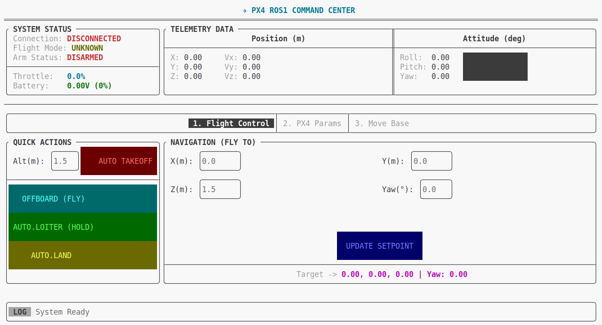
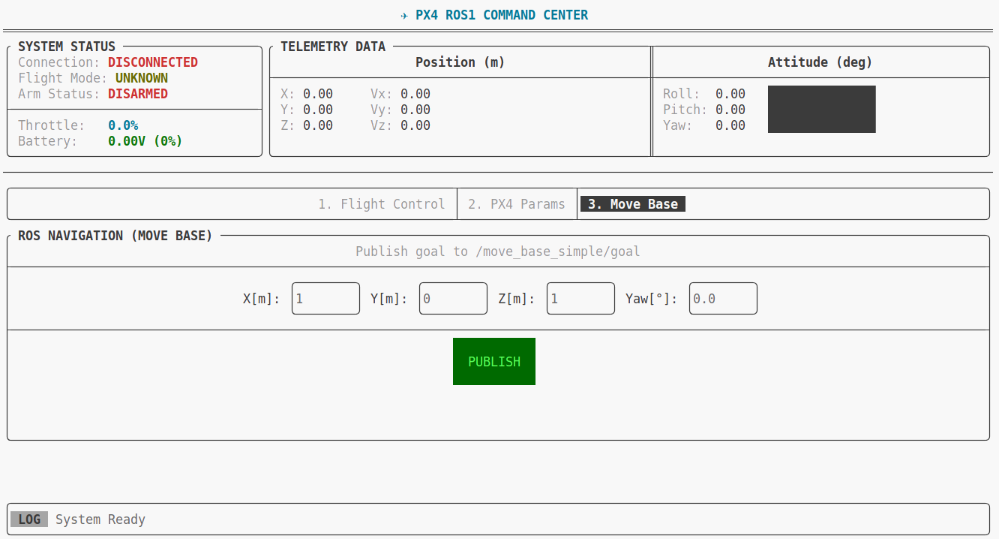

# DroneUI
基于Px4+FTXUI开发的无人机平台
>平台功能简述

可以实时监控PX4无人机的状态数据，设置无人机的定位源，设置无人机自动起飞，OFFBOARD/HOLD功能切换，自动降落,发布无人机位置，发布MOVE_BASE坐标功能

## LINUX环境下安装
```shell
git clone -b v6.1.5 https://github.com/ArthurSonzogni/FTXUI.git
cd FTXUI
mkdir build
cd build && cmake ..
make
sudo make install
```

## 运行
```shell
mkdir -p catkin_ws/src
cd catkin_ws/src
git clone https://github.com/qiurongcan/DroneUI.git
cd ..
catkin_make

. devel/setup.bash
# 运行节点
# rosrun px4_monitor px4_monitor_node
# 建议采用下面这个方法
roslaunch px4_monitor px4_monitor.launch
```

## 无人机状态功能切换界面


## 无人机定位源切换界面


## MOVE BASE 发布界面



<!-- ## FTXUI安装及使用
参考链接：https://www.yuque.com/qqqrc/pvt0eg/dmzik2igke94t8qb?singleDoc# 《FTXUI的安装》 -->

## BUG
|序号|描述|解决情况|
|---|---|---|
|1|设置模式的按钮按下多次后会重复创建多个线程|修复|
|2|位置发送模式会在后台一直发送消息|修复|
|3|mavros监控电量时始终为0V||

<!-- 

检查参数设置 (在 QGC 参数列表中)：

    搜索 BAT 相关参数。
    BAT1_SOURCE (或 BAT_SOURCE)：确保它被设置为 Power Module (通常是 0) 而不是 External 或 None。
    BAT1_V_DIV (电压分压比)：如果这个值不对，读数会偏离，但很少完全为 0。
    BAT_N_CELLS：设置为你的锂电池芯数（例如 3S, 4S）。


 -->